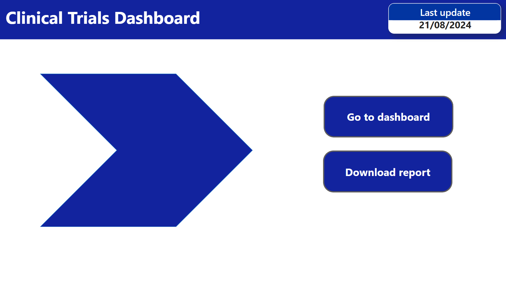
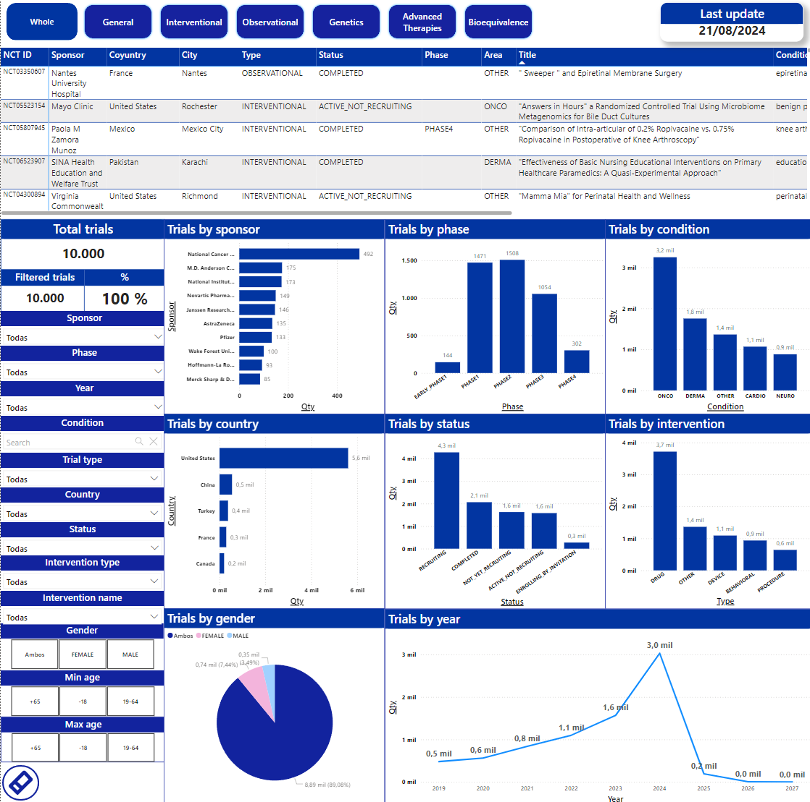
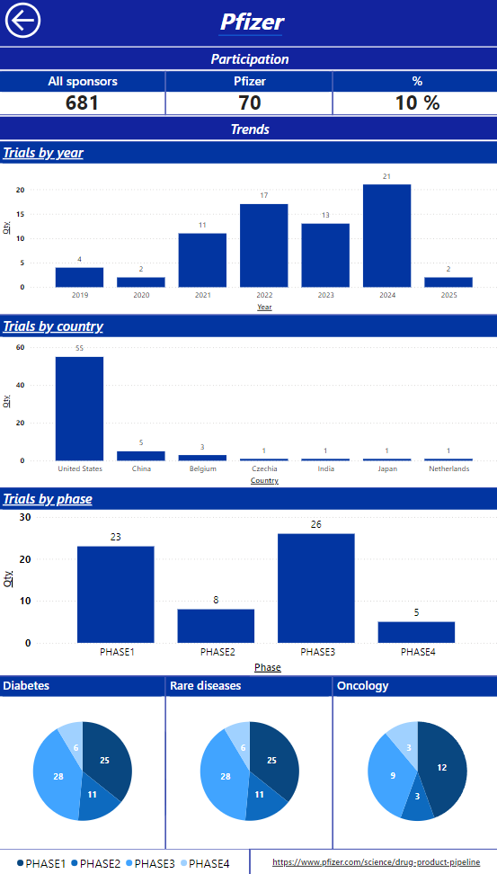

# Clinical Trials Data Extraction and Processing #
- A Python-based solution for retrieving, categorizing, and preprocessing clinical trial data from the ClinicalTrials.gov API, designed for efficient automation and deployment in an Azure environment.

---

# 🌐 Project Overview #
- This project automates the retrieval and systematic processing of clinical trial data using the ClinicalTrials.gov API. It enables keyword-based classification of trials, data cleansing, 
and organization for streamlined analysis and reporting. The workflow is tailored for deployment in Azure, ensuring timely and reliable execution of tasks.

---

# 🚀 Key Features
- **API Integration**: Connects seamlessly with the ClinicalTrials.gov API to retrieve updated trial data.
- **Keyword Classification**: Implements a robust classification system based on user-defined keywords for targeted data insights.
- **Data Preprocessing**: Cleans and structures raw data for improved analysis and usability.
- **Azure Automation**: Configured to execute monthly tasks on the first day at 8:00 AM within the Azure cloud environment.
- **Scalability**: Designed to handle large datasets with optimized performance for extensive clinical trial records.

---

# 📖 Usage Instructions
- Follow this [step-by-step tutorial](https://learn.microsoft.com/en-us/azure/azure-functions/create-first-function-vs-code-python) to configure your Azure environment and deploy the script.
- Populate the `keywords.txt` file in the `Resources` folder with the terms you wish to use for classification (current terms were defined with the support of various medical professionals).
- Execute the script locally for testing or deploy it to Azure for automated execution.
- Processed data will be stored in the `Outputs` folder as CSV files, ready for further analysis.

---

# 📊 Power BI Visualization

